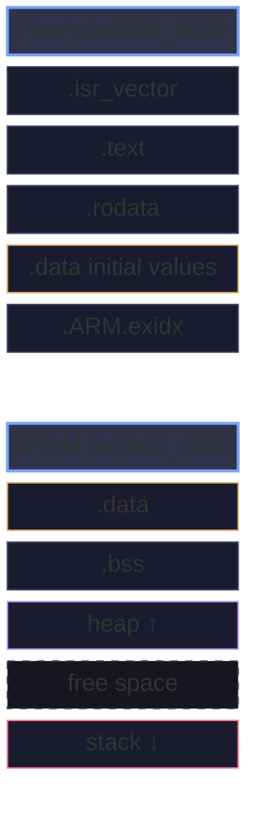
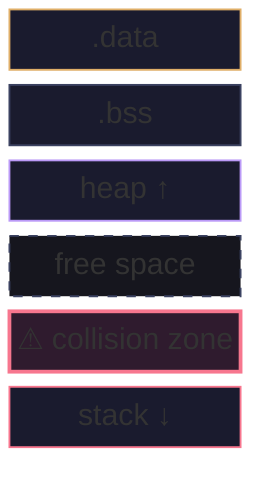
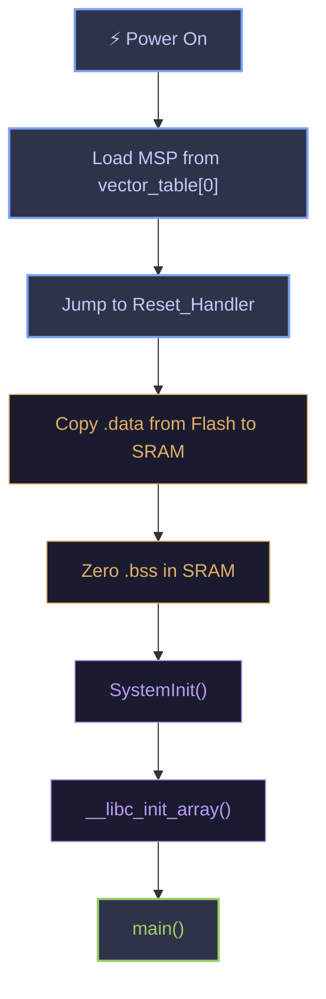

When you compile a firmware binary and flash it to a microcontroller, your code doesn't just land in memory as a flat blob. The linker organizes everything into **memory sections** — distinct regions with specific attributes, initialization requirements, and hardware mappings.

Understanding these sections is the difference between guessing why your firmware crashes and *knowing*. This post walks through every major section, how it maps to physical memory, and the startup machinery that makes it all work.

## The Two-Memory Model

Most microcontrollers have two physically distinct memory types:

| Memory | Type | Speed | Persistence | Example Size |
|--------|------|-------|-------------|-------------|
| Flash | Non-volatile | Slower (wait states) | Survives power loss | 256 KB – 2 MB |
| SRAM | Volatile | Fast (zero wait states) | Lost on reset | 32 KB – 512 KB |

This split is fundamental. Flash holds your program and constants. SRAM holds everything that changes at runtime. The linker script tells the toolchain *what goes where*.

<Details summary="What about Harvard vs Von Neumann?">

ARM Cortex-M uses a **modified Harvard architecture** — separate instruction and data buses, but a unified address space. This means the CPU can fetch instructions from Flash and read data from SRAM simultaneously. The memory map (0x00000000 through 0xFFFFFFFF) is fixed by the ARM architecture, but what's *actually* at each address depends on your specific chip.

Key regions in the Cortex-M memory map:
- `0x00000000` — Code region (Flash, aliased)
- `0x20000000` — SRAM region
- `0x40000000` — Peripheral region (memory-mapped I/O)
- `0xE0000000` — System control space (NVIC, SysTick, SCB)

</Details>

## The Memory Map: A Visual Overview

Before diving into individual sections, here's how a typical firmware image maps to physical memory:



Let's break down each section.

## `.isr_vector` — The Vector Table

The vector table is the **first thing** the CPU reads on reset. It's always placed at the start of Flash (or wherever your boot pins point).

```c
// Typical vector table for STM32 (CMSIS style)
typedef void (*pHandler)(void);

__attribute__((section(".isr_vector")))
const pHandler vector_table[] = {
    (pHandler)0x20008000,    // Initial stack pointer (MSP)
    Reset_Handler,           // Reset handler
    NMI_Handler,             // NMI
    HardFault_Handler,       // Hard fault
    MemManage_Handler,       // Memory management fault
    BusFault_Handler,        // Bus fault
    UsageFault_Handler,      // Usage fault
    0, 0, 0, 0,             // Reserved
    SVC_Handler,             // SVCall
    DebugMon_Handler,        // Debug monitor
    0,                       // Reserved
    PendSV_Handler,          // PendSV
    SysTick_Handler,         // SysTick
    // External interrupts follow...
    WWDG_IRQHandler,
    PVD_IRQHandler,
    TAMPER_IRQHandler,
    // ... (device-specific)
};
```

The first entry isn't a function — it's the **initial stack pointer value**. On reset, the CPU loads this into the Main Stack Pointer (MSP) register *before* jumping to `Reset_Handler`. This is why the stack is "instantly available" — no setup code needed.

> The vector table must be aligned to a power of 2 equal to the total number of exceptions (minimum 128-byte alignment on Cortex-M3/4). The linker handles this, but if you relocate the table at runtime (via SCB->VTOR), you must maintain alignment.

## `.text` — Your Code

The `.text` section holds all executable machine code. This includes:

- All your C/C++ functions
- Library functions you call (or that get linked in)
- Interrupt handlers
- Inline functions that the compiler decided to emit

```c
// This function lives in .text
void led_toggle(void) {
    GPIOA->ODR ^= GPIO_ODR_OD5;
}

// So does this one
int main(void) {
    hal_init();
    while (1) {
        led_toggle();
        delay_ms(500);
    }
}
```

### What ends up in .text that you might not expect

The compiler can pull in surprising amounts of code:

```c
// A single printf can pull in 10-20KB of .text
printf("Temperature: %d\n", temp);

// Floating-point printf support adds another 8-10KB
printf("Voltage: %.2fV\n", voltage);

// Use smaller alternatives in firmware
snprintf(buf, sizeof(buf), "Temp: %d", temp);  // Still big
// Better: integer-only print or custom itoa()
```

<Details summary="Checking your .text size with objdump">

```bash
# Size breakdown by section
arm-none-eabi-size firmware.elf

# Output:
#    text    data     bss     dec     hex filename
#   12480     120    2048   14648    3928 firmware.elf

# Detailed section sizes
arm-none-eabi-objdump -h firmware.elf

# Find which functions are largest
arm-none-eabi-nm --size-sort --print-size firmware.elf | tail -20

# Per-function size breakdown
arm-none-eabi-objdump -d firmware.elf | \
  awk '/^[0-9a-f]+ </{name=$0} /^[0-9a-f]+:/{bytes++} /^$/{if(name && bytes) print bytes*4, name; bytes=0}'
```

</Details>

## `.rodata` — Read-Only Data

Constants, string literals, and `const`-qualified globals go here. On most MCUs, `.rodata` lives in Flash alongside `.text`.

```c
const uint32_t crc_lookup_table[256] = { /* ... */ };  // .rodata
const char device_name[] = "SensorNode-v2";             // .rodata
static const float coefficients[] = {1.5f, 2.3f, 0.7f}; // .rodata

// String literals also land in .rodata
void log_message(void) {
    // The string "System initialized\n" is in .rodata
    uart_send("System initialized\n");
}
```

### The `const` trap on ARM

On ARM Cortex-M, there's a subtlety. If you have a `const` pointer but the data it points to isn't `const`, the **data** won't be in `.rodata`:

```c
// CORRECT: Both pointer and data are const → both in .rodata (Flash)
const char *const error_messages[] = {
    "OK",
    "Timeout",
    "CRC Error",
};

// TRAP: Data is mutable → lands in .data (SRAM), wastes RAM
char *const error_messages[] = {
    "OK",
    "Timeout",
    "CRC Error",
};

// TRAP: Struct has const pointer but non-const config → config in .data
typedef struct {
    const char *name;
    uint32_t baud_rate;     // Not const → in .data
} uart_config_t;

const uart_config_t configs[] = { ... };  // baud_rate still in .data? No —
// Actually, the whole struct is const, so it's in .rodata. But be careful
// with pointer members — the pointer is const, but what it points to might
// not be in .rodata.
```

## `.data` — Initialized Globals

This is where things get interesting. `.data` holds global and static variables with **non-zero initial values**. But here's the key: these variables need to live in SRAM (because they're mutable), but SRAM loses its contents on power loss.

The solution: **the initial values are stored in Flash, and the startup code copies them to SRAM before `main()` runs.**

```c
// These go in .data
uint32_t system_tick = 1000;
static int8_t error_count = -1;
sensor_config_t active_config = {
    .sample_rate = 100,
    .mode = MODE_CONTINUOUS,
    .gain = 4,
};
```

The linker creates two addresses for each `.data` variable:
- **Load address (LMA)** — where it lives in Flash (the initial value)
- **Virtual address (VMA)** — where it lives in SRAM (the runtime location)

The startup code does the copy:

```c
// Simplified startup copy loop (what happens before main())
extern uint32_t _sidata;  // Start of .data initial values in Flash
extern uint32_t _sdata;   // Start of .data in SRAM
extern uint32_t _edata;   // End of .data in SRAM

void copy_data_section(void) {
    uint32_t *src = &_sidata;
    uint32_t *dst = &_sdata;
    while (dst < &_edata) {
        *dst++ = *src++;
    }
}
```

This is why `.data` variables count against **both** Flash and SRAM. A 1KB initialized global costs 1KB of Flash *and* 1KB of SRAM.

## `.bss` — Zero-Initialized Globals

`.bss` (historically from "Block Started by Symbol") holds global and static variables that are initialized to zero — or have no initializer (C guarantees they start as zero).

```c
// These go in .bss
uint32_t packet_count;
static uint8_t rx_buffer[256];
bool device_initialized;
static fault_log_t fault_history[10];
```

Unlike `.data`, `.bss` variables **don't have a stored copy in Flash**. The startup code just fills the SRAM region with zeros:

```c
extern uint32_t _sbss;  // Start of .bss
extern uint32_t _ebss;  // End of .bss

void zero_bss_section(void) {
    uint32_t *dst = &_sbss;
    while (dst < &_ebss) {
        *dst++ = 0;
    }
}
```

This means `.bss` costs **zero Flash** — only SRAM. If you have a large buffer that starts at zero, it belongs in `.bss`:

```c
// BAD: Wastes 4KB of Flash storing the initial zeros
uint8_t dma_buffer[4096] = {0};

// GOOD: No Flash cost, startup code zeros it
uint8_t dma_buffer[4096];
```

Both produce identical runtime behavior, but the second saves 4KB of Flash.

## The Stack

The stack lives at the **top of SRAM** and grows downward. It's used for:

- Local variables
- Function return addresses
- Interrupt context saving (automatic on Cortex-M)
- Function call arguments (first 4 go in registers, rest on stack)

```c
void process_reading(void) {
    // These are on the stack — free when function returns
    float filtered_value;
    char log_entry[128];
    sensor_sample_t samples[8];
    
    // Total stack usage: ~180 bytes for this frame
    // Plus whatever process() and format_log() need
    filtered_value = filter(samples, 8);
    format_log(log_entry, sizeof(log_entry), filtered_value);
}
```

### Stack overflow in firmware

There's no OS to catch stack overflow. On Cortex-M, you get a **HardFault** (or `MemManage` fault if the MPU is configured). The stack collides with `.bss` or `.data` growing upward.



Rule of thumb for stack sizing:
- **Bare-metal with RTOS:** 256–512 bytes per task
- **Bare-metal, no RTOS:** 1–2 KB total
- **Interrupt-heavy systems:** Add 256–512 bytes for worst-case nesting
- **C++ with exceptions:** 2–4 KB (unwinding tables need stack space)

<Details summary="Measuring actual stack usage">

GCC has a built-in stack usage analyzer:

```bash
# Per-function stack usage
arm-none-eabi-gcc -fstack-usage -c main.c
# Produces main.su with entries like:
# main.c:42:process_reading  184  static
# main.c:58:filter           32   static
# main.c:71:isr_handler      48   static

# Runtime watermark technique: fill stack with known pattern
#define STACK_FILL_PATTERN 0xA5A5A5A5

void stack_fill(void) {
    extern uint32_t _estack;  // Top of stack (from linker)
    extern uint32_t _sstack;  // Bottom of stack
    uint32_t *ptr = &_sstack;
    while (ptr < &_estack) {
        *ptr++ = STACK_FILL_PATTERN;
    }
}

uint32_t stack_high_watermark(void) {
    extern uint32_t _estack;
    extern uint32_t _sstack;
    uint32_t *ptr = &_sstack;
    while (*ptr == STACK_FILL_PATTERN && ptr < &_estack) {
        ptr++;
    }
    return (uint32_t)&_estack - (uint32_t)ptr;
}
```

</Details>

## The Heap

The heap is optional in firmware. Many teams avoid it entirely — `malloc` is nondeterministic, can fragment, and failure modes are ugly. But if you use it, it grows upward from the end of `.bss`.

```c
// Dynamic allocation — the heap
sensor_t *sensor = malloc(sizeof(sensor_t));  // Heap
char *name = strdup(device_name);             // Heap (strdup allocates)

// Preferred in firmware: static allocation
static sensor_t sensor;                       // .bss
char name[32];                                // Stack or .bss
```

If you must use dynamic allocation in firmware:
- Use a **fixed-size memory pool** instead of general `malloc`
- Allocate once at startup, never free
- Use `calloc` instead of `malloc` + `memset`
- Check the return value — always

## The Linker Script

The linker script (`.ld` file) is the blueprint for how sections map to physical memory. Here's a minimal but realistic one for an STM32F103 (Cortex-M3, 64KB SRAM, 128KB Flash):

```ld
/* STM32F103C8T6 Memory Layout */
MEMORY
{
    FLASH (rx)  : ORIGIN = 0x08000000, LENGTH = 128K
    SRAM (rwx)  : ORIGIN = 0x20000000, LENGTH = 20K
}

/* Symbols exposed to C code */
_estack = ORIGIN(SRAM) + LENGTH(SRAM);  /* Stack starts at top of SRAM */

SECTIONS
{
    /* Vector table — must be first in Flash */
    .isr_vector :
    {
        . = ALIGN(4);
        KEEP(*(.isr_vector))
        . = ALIGN(4);
    } > FLASH

    /* Code */
    .text :
    {
        *(.text)
        *(.text*)
        *(.glue_7)
        *(.glue_7t)
        KEEP(*(.init))
        KEEP(*(.fini))
    } > FLASH

    /* Read-only data */
    .rodata :
    {
        . = ALIGN(4);
        *(.rodata)
        *(.rodata*)
        . = ALIGN(4);
    } > FLASH

    /* ARM exception unwinding tables (C++) */
    .ARM.extab :
    {
        *(.ARM.extab*)
    } > FLASH

    .ARM.exidx :
    {
        __exidx_start = .;
        *(.ARM.exidx*)
        __exidx_end = .;
    } > FLASH

    /* .data initial values — stored in Flash, loaded to SRAM */
    _sidata = LOADADDR(.data);

    .data :
    {
        . = ALIGN(4);
        _sdata = .;         /* Start of .data (SRAM) */
        *(.data)
        *(.data*)
        . = ALIGN(4);
        _edata = .;         /* End of .data (SRAM) */
    } > SRAM AT> FLASH      /* VMA in SRAM, LMA in Flash */

    /* Zero-initialized data */
    .bss :
    {
        . = ALIGN(4);
        _sbss = .;          /* Start of .bss */
        *(.bss)
        *(.bss*)
        *(COMMON)
        . = ALIGN(4);
        _ebss = .;          /* End of .bss */
    } > SRAM

    /* Heap starts after .bss */
    . = ALIGN(4);
    _end = .;               /* End of all sections (heap start) */
    _sheap = _end;
    _eheap = _estack - 2048; /* Reserve 2KB for stack */
}
```

The critical line is `> SRAM AT> FLASH` — this tells the linker:
- **VMA (Virtual Memory Address):** Place `.data` in the SRAM address range
- **LMA (Load Memory Address):** Store the initial values in Flash

The startup code uses the `AT>` address to find what to copy.

## The Startup Sequence

Here's the complete sequence from power-on to `main()`:



Here's a real startup file for GCC:

```c
// startup.c — Cortex-M startup code
#include <stdint.h>

// Linker-defined symbols
extern uint32_t _estack;      // Top of stack
extern uint32_t _sidata;      // .data init values (Flash)
extern uint32_t _sdata;       // .data start (SRAM)
extern uint32_t _edata;       // .data end (SRAM)
extern uint32_t _sbss;        // .bss start
extern uint32_t _ebss;        // .bss end

// Forward declarations
void Reset_Handler(void);
void Default_Handler(void);

// Weak aliases — override in your code
void NMI_Handler(void)           __attribute__((weak, alias("Default_Handler")));
void HardFault_Handler(void)     __attribute__((weak, alias("Default_Handler")));
void MemManage_Handler(void)     __attribute__((weak, alias("Default_Handler")));
void BusFault_Handler(void)      __attribute__((weak, alias("Default_Handler")));
void UsageFault_Handler(void)    __attribute__((weak, alias("Default_Handler")));
void SVC_Handler(void)           __attribute__((weak, alias("Default_Handler")));
void PendSV_Handler(void)        __attribute__((weak, alias("Default_Handler")));
void SysTick_Handler(void)       __attribute__((weak, alias("Default_Handler")));

extern int main(void);
void SystemInit(void);

// Vector table
__attribute__((section(".isr_vector")))
const uint32_t vector_table[] = {
    (uint32_t)&_estack,
    (uint32_t)Reset_Handler,
    (uint32_t)NMI_Handler,
    (uint32_t)HardFault_Handler,
    (uint32_t)MemManage_Handler,
    (uint32_t)BusFault_Handler,
    (uint32_t)UsageFault_Handler,
    0, 0, 0, 0,
    (uint32_t)SVC_Handler,
    0,
    0,
    (uint32_t)PendSV_Handler,
    (uint32_t)SysTick_Handler,
};

void Reset_Handler(void) {
    // 1. Copy .data section from Flash to SRAM
    uint32_t *src = &_sidata;
    uint32_t *dst = &_sdata;
    while (dst < &_edata) {
        *dst++ = *src++;
    }

    // 2. Zero-initialize .bss
    dst = &_sbss;
    while (dst < &_ebss) {
        *dst++ = 0;
    }

    // 3. System init (clocks, etc.)
    SystemInit();

    // 4. Jump to main
    main();

    // main() should never return, but just in case
    while (1);
}

void Default_Handler(void) {
    // Catch-all for unhandled interrupts
    while (1);
}
```

## Section Attributes — Placing Variables Where You Want

GCC lets you explicitly place variables and functions in custom sections:

```c
// Put a frequently-accessed struct in DTCM (if available)
// for zero-wait-state access
__attribute__((section(".dtcm_data")))
volatile adc_reading_t latest_adc;

// Put a large lookup table in a non-cacheable region
__attribute__((section(".noncacheable")))
const int16_t sin_table[360];

// Put a function in RAM for faster execution
// (useful for flash-programming routines that run from SRAM)
__attribute__((section(".ram_code"), long_call))
void flash_write(uint32_t addr, uint32_t data) {
    // ...
}

// Align to cache line boundary (32 bytes on Cortex-M7)
__attribute__((aligned(32)))
uint8_t dma_buffer[256];

// Pack struct to avoid padding (common for protocol frames)
__attribute__((packed))
typedef struct {
    uint8_t  preamble;
    uint16_t length;
    uint8_t  payload[64];
    uint16_t crc;
} packet_t;
```

### MPU-aligned sections for safety

On Cortex-M7 (and M3/M4 with MPU), you can protect memory regions:

```ld
/* In linker script — create a protected RAM region */
MEMORY
{
    FLASH   (rx)  : ORIGIN = 0x08000000, LENGTH = 512K
    DTCM    (rwx) : ORIGIN = 0x20000000, LENGTH = 128K
    SRAM_D2 (rwx) : ORIGIN = 0x30000000, LENGTH = 256K
    SRAM_D3 (rwx) : ORIGIN = 0x38000000, LENGTH = 64K
}

SECTIONS
{
    /* Critical data in DTCM — fast, MPU-protectable */
    .critical_data :
    {
        *(.critical_data*)
    } > DTCM

    /* DMA buffers in SRAM_D2 — non-cacheable */
    .dma_buffers (NOLOAD) :
    {
        *(.dma_buffer*)
    } > SRAM_D2
}
```

## Debugging Memory Layout

Your most important tools:

### objdump — inspect sections

```bash
# List all sections with addresses and sizes
arm-none-eabi-objdump -h firmware.elf

# Output:
# Idx Name          Size      VMA       LMA       File off  Algn
#   0 .isr_vector   00000130  08000000  08000000  00010000  2**0
#   1 .text         00002c58  08000130  08000130  00010130  2**2
#   2 .rodata       00000420  08002d88  08002d88  00012d88  2**3
#   3 .data         00000080  20000000  080031a8  00020000  2**2
#   4 .bss          00000104  20000080  20000080  00020080  2**2
```

Note `.data` — VMA is `0x20000000` (SRAM) but LMA is `0x080031a8` (Flash). This is the dual-addressing at work.

### nm — symbol addresses

```bash
# Find where a specific variable lives
arm-none-eabi-nm firmware.elf | grep system_tick
# 20000004 D system_tick    ← 'D' = .data section

arm-none-eabi-nm firmware.elf | grep rx_buffer
# 20000100 B rx_buffer      ← 'B' = .bss section

arm-none-eabi-nm firmware.elf | grep crc_table
# 08002da0 R crc_table      ← 'R' = .rodata section
```

### size — quick summary

```bash
arm-none-eabi-size firmware.elf
#    text    data     bss     dec     hex filename
#  12480     120    2048   14648    3928 firmware.elf
#
# Flash used = text + data = 12600 bytes
# SRAM used  = data + bss  = 2168 bytes (at minimum, excludes stack/heap)
```

### readelf — detailed analysis

```bash
# Full section headers with flags
arm-none-eabi-readelf -S firmware.elf

# Check if .data LMA is in Flash range
arm-none-eabi-readelf -l firmware.elf
```

## Common Pitfalls

### 1. Forgetting volatile on memory-mapped I/O

```c
// BUG: Compiler may optimize away the read
uint32_t status = *reinterpret_cast<uint32_t*>(0x40020000);
if (status & 0x01) { ... }

// CORRECT: Volatile prevents optimization
volatile uint32_t *status_reg = (volatile uint32_t *)0x40020000;
if (*status_reg & 0x01) { ... }
```

### 2. Large initialized arrays wasting Flash

```c
// BAD: 1KB of zeros stored in Flash, then copied to SRAM
uint8_t framebuffer[1024] = {0, 0, 0, /* ... 1018 more zeros */ };

// GOOD: Zero-initialized, lives in .bss (no Flash cost)
uint8_t framebuffer[1024];

// GOOD: If you need non-zero init, do it at runtime
uint8_t framebuffer[1024];
memset(framebuffer, 0xFF, sizeof(framebuffer));  // At runtime, no Flash cost
```

### 3. Stack collision with .bss

```c
// If your .bss + .data gets too large, the stack has nowhere to go
uint8_t huge_buffer[16384];  // 16KB — on a 20KB SRAM chip, only 4KB left!

// Fix: Use external RAM, or DMA directly to peripheral, or reduce buffer size
```

### 4. Printf pulling in heap

Standard `printf` calls `malloc` internally. On bare-metal, you need to provide `__attribute__((weak))` stubs or implement `_sbrk`:

```c
// Minimal _sbrk for newlib — needed for printf/malloc
extern uint32_t _end;
extern uint32_t _eheap;
static uint32_t *heap_ptr = &_end;

void *_sbrk(ptrdiff_t incr) {
    uint32_t *current = heap_ptr;
    if (heap_ptr + (incr / 4) > &_eheap) {
        errno = ENOMEM;
        return (void *)-1;
    }
    heap_ptr += incr / 4;
    return current;
}
```

## Advanced: Custom Sections for Bootloaders

If you're building a bootloader, you need to control exactly where things go:

```ld
/* Bootloader + Application memory layout */
MEMORY
{
    BOOTLOADER (rx) : ORIGIN = 0x08000000, LENGTH = 16K
    APP_FLASH (rx)  : ORIGIN = 0x08004000, LENGTH = 240K
    CONFIG     (r)  : ORIGIN = 0x0803F000, LENGTH = 4K
    SRAM      (rwx) : ORIGIN = 0x20000000, LENGTH = 64K
}

SECTIONS
{
    /* Application header — placed at start of APP_FLASH */
    .app_header :
    {
        KEEP(*(.app_header))
    } > APP_FLASH

    .text :
    {
        *(.text*)
    } > APP_FLASH

    /* Configuration data — separate section for easy erasure */
    .config :
    {
        KEEP(*(.config_data))
    } > CONFIG
}
```

```c
// Application header — checked by bootloader
__attribute__((section(".app_header")))
const app_header_t app_header = {
    .magic = 0xDEADBEEF,
    .version = 0x00010002,
    .size = sizeof_application,
    .crc32 = 0,  // Filled by post-build script
    .entry_point = (uint32_t)main,
};
```

The bootloader reads `.app_header` at `0x08004000`, validates the CRC, and jumps to the entry point.

## Checklist: Auditing Your Firmware's Memory

Before shipping, run through this:

1. **`arm-none-eabi-size firmware.elf`** — total Flash and SRAM usage
2. **Verify `.data` is minimal** — every initialized global costs Flash *and* RAM
3. **Check stack size** — use `-fstack-usage` and add worst-case call chain + interrupt nesting
4. **Confirm no heap fragmentation** — either don't use `malloc`, or allocate once at startup
5. **Map every byte** — your linker script symbols (`_sdata`, `_edata`, `_sbss`, `_ebss`, `_estack`) should add up to your total SRAM
6. **Test with stack watermarking** — fill stack with a pattern, run your worst-case scenario, check how much was used
7. **Verify DMA buffer alignment** — DMA controllers often require word-aligned buffers in specific memory regions

Understanding your firmware's memory layout isn't optional — it's the foundation for debugging hard faults, optimizing size, and building reliable products that don't surprise you in the field.
